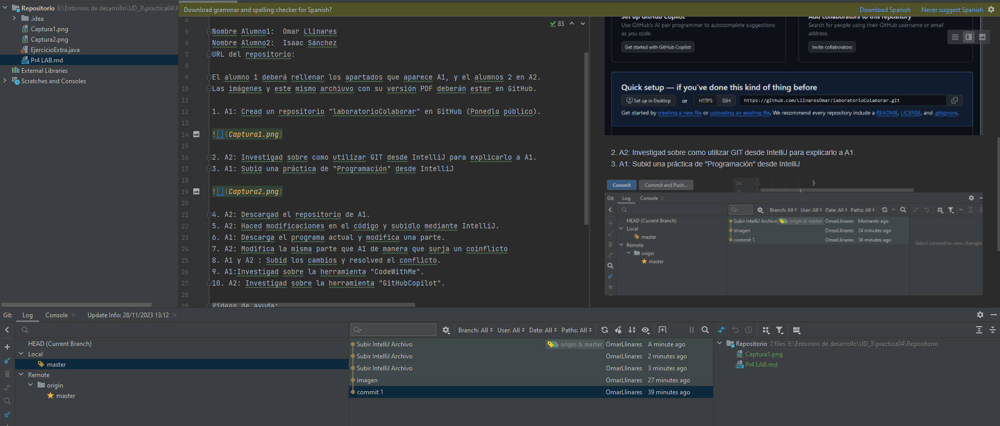
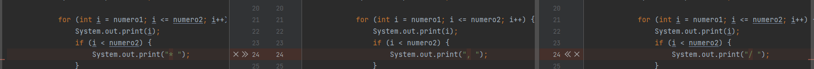

# Practica 4 - Investigación sobre trabajo colaborativo

Esta práctica se realizará por parejas, pero ambos alumnos deberán de entregar el PDF en aules. Se va a trabajar la colaboración en proyectos mediante GitHub.

Nombre Alumno1:  Omar Llinares  
Nombre Alumno2:  Isaac Sánchez  
URL del repositorio: 

El alumno 1 deberá rellenar los apartados que aparece A1, y el alumnos 2 en A2.  
Las imágenes y este mismo archiuvo con su versión PDF deberán estar en GitHub.

1. A1: Cread un repositorio "laboratorioColaborar" en GitHub (Ponedlo público).

2. A2: Investigad sobre como utilizar GIT desde IntelliJ para explicarlo a A1.
3. A1: Subid una práctica de "Programación" desde IntelliJ

4. A2: Descargad el repositorio de A1.

5. A2: Haced modificaciones en el código y subidlo mediante IntelliJ.

6. A1: Descarga el programa actual y modifica una parte.

7. A2: Modifica la misma parte que A1 de manera que surja un coinflicto

8. A1 y A2 : Subid los cambios y resolved el conflicto.

9. A1:Investigad sobre la herramienta "CodeWithMe".

Es una funcionalidad para los IDE de Jet Brains, para poder ver, editar, debugear etc... el código de forma compartida y a tiempo real. 

10. A2: Investigad sobre la herramienta "GitHubCopilot".

Herramienta IA basada en la nube desarrollada por Open AI y GitHub. El objetivo es asistir a los usuarios de JetBrains con un autocompletado del código.

Enlace a Repositorio:
https://github.com/LlinaresOmar/laboratorioColaborar.git

